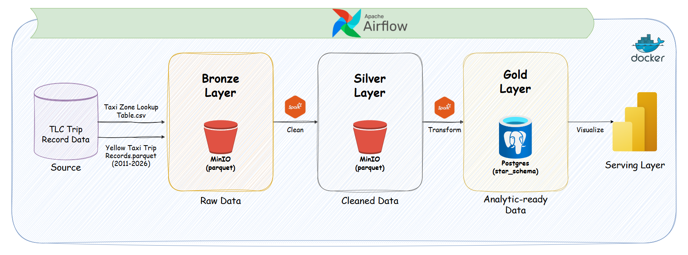

# NYC-TLC-Trip-data-pipeline

# Objectives 
The project aims to build a compact data pipeline for the NYC Yellow Taxi dataset, facilitating business decision making process. The ultimate goal of this project is answering 3 questions:
- What is the peak hour, where the demand for taking taxi is highest?
- Which location in New York city help gain the most revenue?
- How the average speed of each trip change over the time in a day?
These business insights are visualized through an interactive Power BI dashboard.
## Architecture 


## Tech Stack
| Category               | Technology              | Purpose                                                                                                                                |
| ---------------------- | ----------------------- | -------------------------------------------------------------------------------------------------------------------------------------- |
| Programming Language   | Python                  | Main language for implementing ingestion, orchestration scripts.                                                     |
| Data Processing        | Apache Spark            | Performs distributed data transformation, cleansing, feature engineering, and star schema construction for the Silver and Gold layers. |
| Workflow Orchestration | Apache Airflow          | Schedules and orchestrates the end-to-end data pipeline, including ingestion, transformation, and loading tasks.                       |
| Object Storage         | MinIO                   | Stores raw (Bronze) and cleaned (Silver) datasets in a data lake using the S3-compatible API.                                          |
| Data Warehouse         | PostgreSQL              | Stores the Gold layer as a relational data warehouse using a star schema for analytical queries.                                       |
| Data Modeling          | Star Schema             | Organizes analytical data into fact and dimension tables to improve query performance and support BI reporting.                        |
| Visualization          | Power BI                | Connects to PostgreSQL to build interactive dashboards and answer business questions.                                                  |
| Containerization       | Docker & Docker Compose | Provides a reproducible environment for Airflow, Spark, PostgreSQL, and MinIO, simplifying deployment and development.                 |

# Star Schema

## 1. Fact Table: `fact_trips`

This table contains core metrics and transactional data for individual taxi trips.

| Column Name | Data Type | Key | Description |
| :--- | :--- | :--- | :--- |
| `trip_id` | BIGSERIAL | PK | Unique identifier for each individual trip. |
| `pickup_location_id` | INT | FK | Foreign key referencing `dim_location(location_id)` representing the start location of the trip. |
| `dropoff_location_id` | INT | FK | Foreign key referencing `dim_location(location_id)` representing the destination location of the trip. |
| `payment_id` | INT | FK | Foreign key referencing `dim_payment(payment_id)` representing the method used to pay for the trip. |
| `pickup_datetime` | TIMESTAMP | | The date and time when the meter was engaged (trip started). |
| `dropoff_datetime` | TIMESTAMP | | The date and time when the meter was disengaged (trip ended). |
| `passenger_count` | DOUBLE | | The number of passengers in the vehicle (driver-entered value). |
| `trip_distance` | DOUBLE | | The elapsed trip distance in miles. |
| `fare_amount` | DOUBLE | | The time-and-distance fare calculated by the meter. |
| `extra` | DOUBLE | | Miscellaneous extras and surcharges (e.g., rush hour or overnight charges). |
| `tip_amount` | DOUBLE | | Tip amount automatically populated for credit card payments (cash tips are not included). |
| `total_amount` | DOUBLE | | The total amount charged to the passenger (sum of fare, extra, tips, taxes, etc.). |
| `trip_duration` | DOUBLE | | The total duration of the trip (usually calculated in seconds or minutes). |
| `average_speed` | DOUBLE | | The calculated average speed of the vehicle during the trip. |

---

## 2. Dimension Table: `dim_location`

This table contains geographic details about the pickup and drop-off locations.

| Column Name | Data Type | Key | Description |
| :--- | :--- | :--- | :--- |
| `location_id` | INT | PK | Unique identifier for each location/zone. |
| `borough` | VARCHAR | | The name of the borough where the location is situated (e.g., Manhattan, Brooklyn, Queens). |
| `zone` | VARCHAR | | The specific taxi zone/neighborhood name. |
| `service_zone` | VARCHAR | | The type of service zone (e.g., Yellow Zone, Boro Zone, Airports). |

---

## 3. Dimension Table: `dim_payment`

This table contains the lookup information for payment methods used by passengers.

| Column Name | Data Type | Key | Description |
| :--- | :--- | :--- | :--- |
| `payment_id` | INT | PK | Unique identifier for each payment method. |
| `payment_name` | VARCHAR | | The descriptive name of the payment method (e.g., Credit Card, Cash, No Charge, Dispute). |

# Project Structure
```
NYC-TLC-TRIP-DATA/
├── .venv/
├── config/
├── dags/
│   ├── etl_pipeline.py
│   ├── init_database.py
│   └── init_storage.py
├── logs/
├── plugins/
├── sql/
│   ├── dim_location.sql
│   ├── dim_payment.sql
│   ├── fact_trip.sql
│   └── gold_schema.sql
├── src/
│   ├── bronze/
│   │   └── ingestion.py
│   ├── silver/
│   │   ├── transform_taxi.py
│   │   └── transform_zone.py
│   ├── gold/
│   │   ├── dim_location.py
│   │   ├── dim_payment.py
│   │   ├── fact_trip.py
│   │   └── transform_gold.py
│   └── utils/
│       ├── db_connection.py
│       └── logger.py
├── .env.example
├── .gitignore
├── architecture.png
├── docker-compose.yaml
├── Dockerfile
├── LICENSE
├── README.md
└── requirements.txt
```

# Set up
Follow these steps to set up the environment and run the data pipeline.

## Prerequisites
Make sure you have **Docker** and **Docker Compose** installed on your system.

## Step 1: Build Images
Run the following command in your terminal to build the custom Docker image and start all infrastructure services (Airflow, Postgres, Redis, MinIO):

```bash
docker compose up --build
```

## Step 2: Access Web UIs
Once all services are up and running, you can access the following web interfaces:
- Apache Airflow UI: http://localhost:8080

```bash
Credentials: Username: airflow / Password: airflow
```
- MinIO Console: http://localhost:9001

```bash
Credentials: Username: minioadmin / Password: minioadmin
```
## Step 3: Configure Airflow Connection
To allow Airflow to communicate with your PostgreSQL database, you need to set up a connection manually in the Airflow UI:

- Go to Admin > Connections in the top menu.

- Click the + (Add a new record) button.

- Configure the connection with the following details:

```bash
Connection Id: star_schema

Connection Type: Postgres

Host: postgres

Database: airflow

Login: airflow

Password: airflow

Click Save.
```

## Step 4: Execute the DAGs Sequence
Run the DAGs manually in the Airflow UI in the following specific order:

`Trigger init_storage`: This will initialize your storage layer and create the required MinIO buckets.

`Trigger init_star_schema`: This will execute the SQL scripts to create the dimension and fact tables in Postgres.

`Trigger etl_dag`: This will trigger the main ETL pipeline to ingest, transform, and load the NYC taxi trip data into the star schema.
